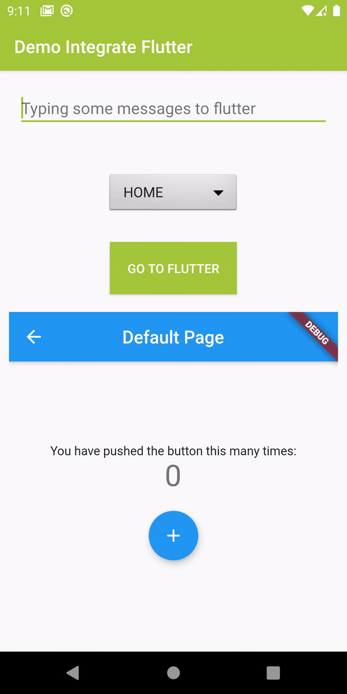
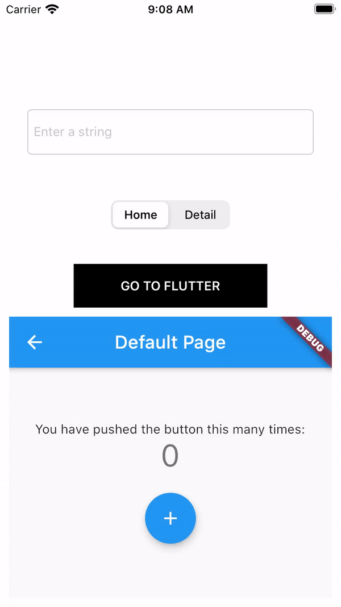

# Demo Integrate Flutter

## Description

Demo add Flutter to existing Android and iOS native apps. 
There are mutiple options to embed Flutter module in existing app and I'll choose: 

- iOS: Option C - Embed application and plugin frameworks in Xcode and Flutter framework with CocoaPods.
- Android: Option A - Depend on the Android Archive (AAR).
   

These method don't requires other developer working on the project to have a locally installed version of the Flutter SDK to run the project.

## Feature

- Add Flutter to existing native project (Android & iOS).
- Running multiple Flutter instances (different engine, entrypoint) with partial screen & full screen.

## How to run

- Clone this repository.
- Go to Flutter module (duy_flutter_module).
- Run `flutter pub get`, `flutter build aar`, `flutter build ios-framework --cocoapods` to regenerate AAR and Framework files.

##### Android

- Open ./android folder by Android Studio then run the app as usual.

##### iOS

- Go to ./ios folder.
- Run `pod install` command.
- Open .xcworkspace file to run the app by Xcode.

## Demo

https://youtu.be/8u6MEziPCdY

## Screenshots

## Note about Caching and Pre-warm FlutterEngine

- Cache help you load Flutter faster from the 2nd onwards.
- Pre-warm help you warm up a FlutterEngine before arriving.
- But pre-warm execute entire your Flutter screen (initState, build...) as normal except attach to UI, so if you need some param from native code before doing an action in Flutter (e.g. get accessToken from native to load data from api in Dart) you can't put your fetch api function in initState as normal.
- At this time, you need a trigger from native code to execute fetch api function in Dart (invoke in MethodChannel from native code and setMethodCallHandler in Dart code to do this).
